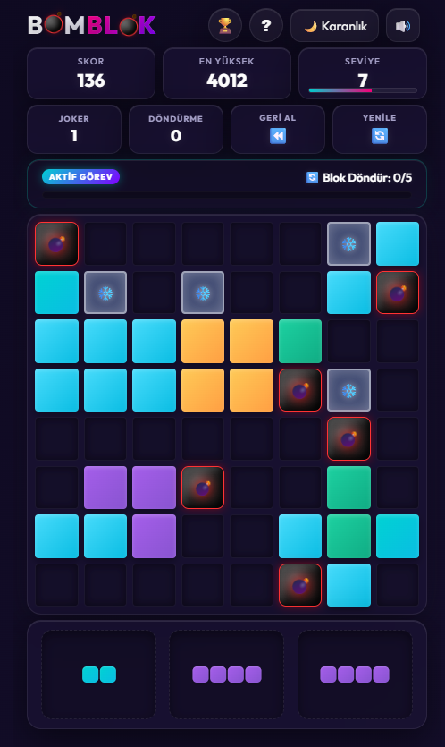

<div align="center">

# 💣 BomBlok

### 🧩 Hızlı, şık ve bağımlılık yapıcı bir `8x8` block puzzle deneyimi

[](https://alp3rol.github.io/BomBlok/)
[](https://github.com/Alp3rol/BomBlok)


**[🎯 Hemen Oyna](https://alp3rol.github.io/BomBlok/)** • **[📦 Repoyu Aç](https://github.com/Alp3rol/BomBlok)** • **[🏆 Supabase Kurulumu](./SUPABASE_SETUP.md)**

</div>

BomBlok, klasik blok yerleştirme mantığını alıp onu daha dinamik bir oyun döngüsüne dönüştürür. Bomba bloklar, buzlu hücreler, görevler, joker sistemi, `XP` ilerlemesi, tema seçenekleri ve çevrim içi leaderboard sayesinde her tur biraz daha stratejik ve daha bağımlılık yapıcı hale gelir.

## 🖼️ Oyun görünümü

<div align="center">
  
</div>


## ✨ Neden BomBlok

- 🎮 Klasik block puzzle hissi
- 💣 Bomba bloklarla zincir etkili temizlemeler
- 🧊 Buzlu hücrelerle ekstra strateji
- 🏆 Haftalık ve global leaderboard
- 🌈 Birden fazla tema seçeneği
- 🔄 Döndürme, yenileme ve geri alma destekleri
- ⭐ `XP` ve seviye sistemi
- 🔥 Geçici `Fever Mode` ile hızlanan tempo
- 📱 Mobil uyumlu kompakt arayüz
- 🚀 GitHub Pages ile kolay yayınlama

## 🕹️ Oynanış

Oyuncu, alt bölümde bekleyen şekilleri `8x8` tahtaya yerleştirir ve satır ya da sütunları tamamlayarak alan açar. Doğru hamleler yalnızca skor kazandırmaz; combo zincirleri, görev ilerlemesi, joker ödülleri ve seviye gelişimiyle birlikte oyunun ritmini de yükseltir.

Dar ekranlarda rahat oynanabilmesi için arayüz kompakt tutulmuştur. Özellikle mobil cihazlar ve iOS Safari için viewport davranışları ayrıca ele alınmış, böylece oyun alanı ile alt kontrollerin görünürlüğü korunmuştur.

## 🎯 Nasıl oynanır

1. 🧩 Alttaki üç şekilden birini seç.
2. 📦 Şekli tahtadaki uygun boşluğa yerleştir.
3. 💥 Tam dolan satır veya sütunları patlatarak alan aç.
4. 🔄 Sıkışırsan döndürme, yenileme ve geri alma sistemlerini kullan.
5. 🎁 Görevleri tamamlayarak joker kazan.
6. 🏆 Skorunu kaydedip leaderboard’da yükselmeye çalış.

## ⚙️ Oyun mekanikleri

### 💣 Bomba bloklar

Bazı şekiller özel bomba etkisiyle gelir. Bu blokların dahil olduğu temizlemelerde çevresel alan da etkilenir ve tek hamlede daha büyük boşluklar açılabilir.

### 🧊 Buzlu hücreler

Buzlu alanlar doğrudan kullanılamaz. Yakınındaki satır veya sütun temizlemeleriyle bu hücrelerin kilidi kırılır ve oyun alanı yeniden açılır.

### 🎁 Görev ve joker sistemi

Oyun boyunca aktif görevler değişir. Hedefleri tamamlayan oyuncu joker kazanır; bu jokerler sıkışılan anlarda oyunu kurtarabilecek güçlü yardımcılar sağlar.

### ⭐ XP ve seviye sistemi

Her başarılı oyun ilerlemeye katkı verir. Seviye yükseldikçe oyun daha canlı, daha yoğun ve daha zorlayıcı bir ritme geçer.

### 🔥 Fever Mode

Belirli koşullarda devreye giren `Fever Mode`, kısa süreli yüksek tempolu bir avantaj sunar. Bu mod sırasında daha agresif puanlama ve daha heyecanlı bir akış hissedilir.

## 🧱 Teknoloji yapısı

- 🌐 Arayüz: `HTML5` + `CSS3`
- 🧠 Oyun mantığı: `Vanilla JavaScript`
- 💾 Yerel veri saklama: `localStorage`
- 🏆 Online skor sistemi: `Supabase`
- 🚀 Yayınlama: `GitHub Pages`
- ⚡ Otomasyon: `GitHub Actions`

## 📁 Proje yapısı

```text
.
├── index.html
├── style.css
├── themes.css
├── app.js
├── supabase-config.example.js
├── SUPABASE_SETUP.md
└── .github/workflows/deploy.yml
```

## 🚀 Lokal çalıştırma

Projeyi doğrudan tarayıcıda açmak mümkün olsa da, geliştirme sırasında basit bir local server kullanmak daha sağlıklıdır.

```bash
git clone https://github.com/Alp3rol/BomBlok.git
cd BomBlok
python -m http.server 8000
```

Sonrasında tarayıcıda `http://localhost:8000` adresini açman yeterlidir.

## 🏆 Supabase kurulumu

Leaderboard özelliğini kullanmak için bir Supabase projesi oluşturup gerekli tablo ve politikaları tanımlaman gerekir. Ayrıntılı kurulum adımları `SUPABASE_SETUP.md` dosyasında yer alır.

Lokal geliştirme için:

1. `supabase-config.example.js` dosyasını kopyalayıp `supabase-config.js` olarak oluştur.
2. İçine yalnızca `Supabase URL` ve `anon public key` bilgilerini gir.

## 🌍 Deploy

Proje, `main` dalına yapılan her push sonrasında GitHub Pages’e yayınlanacak şekilde yapılandırılmıştır. Workflow, ihtiyaç halinde `supabase-config.js` dosyasını GitHub Actions secret’larından otomatik olarak üretir.

Tanımlanabilecek secret’lar:

- `SUPABASE_URL`
- `SUPABASE_ANON_KEY`

Bu değerler tanımlı değilse oyun yine yayınlanır; sadece leaderboard özelliği kapalı kalır.

## 🔐 Güvenlik notu

İstemci tarafında hiçbir zaman `service_role` veya başka bir gizli Supabase anahtarı kullanılmamalıdır. Repoda yalnızca örnek yapılandırma dosyası tutulmalı; gerçek değerler yerel dosyada veya GitHub Actions secret’larında saklanmalıdır.

## 📱 Arayüz yaklaşımı

Oyunun temel grid yapısı korunarak daha kompakt ve cihaz dostu bir düzen hedeflenmiştir. Özellikle dar ekranlar, iPhone sınıfı cihazlar ve mobil tarayıcı davranışları dikkate alınarak görünürlük ile oynanabilirlik dengelenmiştir.

## 🛠️ Katkı

Projeyi geliştirmek istersen issue açabilir, fork alabilir veya bu temel yapı üstüne kendi fikirlerini inşa edebilirsin. Yeni mekanikler, tema paketleri, görev türleri ve leaderboard iyileştirmeleri için proje genişlemeye uygundur.
